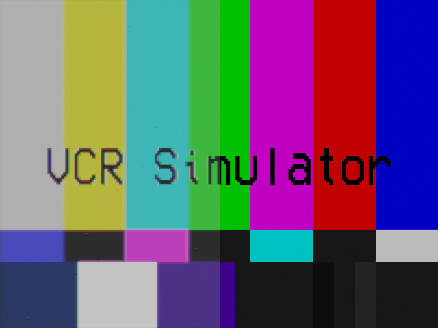

# Blender VHS Simulator Pipeline

This repository contains a blender based VHS simulator pipeline for video processing. There is a blend file that contains a compositing set up that simulates different physical aspects of VHS tapes, and a bash script that renders an interlaced video file to match the [480i NTSC standard](https://en.wikipedia.org/wiki/480i). Many physical aspects of the tape simulation are recreated from the descriptions in [Scotch Video Tapes 1980's VHS Primer](https://youtu.be/Cj0lvGqTkD0) video.

## VHS Simulator

`vhs.blend` contains the multiple compositor nodes that control both physical and aesthetic properties of VHS tapes.

### Crop and Scale

This node contains sub-nodes to crop the input image/clip to a 4:3 ratio, then scale that cropped image to the `Resolution X` and `Resolution Y` of the Scene's dimensions.

### Luma to Chroma Ratio

This node reduces the color information in relation to the luminance information in the image to fit the [ratio supported by VHS tape](https://en.wikipedia.org/wiki/VHS#Video_recording).

### Video Frequency Response
[Video frequency response](https://youtu.be/Cj0lvGqTkD0?t=948) measures how well picture detail is reproduced.

### Signal to Noise Ratio

This node simulates the signal to noise ratio of data held by the magnetic tape. A higher dB value results in a higher quality image. This can be adjusted for both the luma signal and the chroma signal separately.

### Color Bleed

This node simulates CRT-like RGB color bleed onto other pixels. The bleed per color can be dialed up and down.

### Phase Modulation Noise

[Phase modulation noise](https://youtu.be/Cj0lvGqTkD0?t=846) simulates color banding seen in degraded tape. Banding can be controlled by intensity, offset, and scale which correlates to the number of bands seen. A lower scale makes the bands larger, and a larger scale makes the bands thinner but increases their number.

### Chroma Output

[Chroma output](https://youtu.be/Cj0lvGqTkD0?t=879) is a measure of the chroma saturation of the image.

### Video RF Output

[Video RF output](https://youtu.be/Cj0lvGqTkD0?t=894) is the maximum amount of playback signal compared to that of a reference tape.

### Dropouts

[Dropouts](https://youtu.be/Cj0lvGqTkD0?t=970) are an artifact generated by video head / tape separation.

## Interlacing Script

`interlace-video.sh` requires [`ffmpeg`](https://ffmpeg.org/). The script takes a file or range of frame images and renders a lossless interlaced video file for use in editing software. The [NTSC 480i standard](https://en.wikipedia.org/wiki/480i) would have been interlaced on tape.

### A Note on Framerate

VHS tapes were recorded at 59.94 interlaced fields per second, equivalent to 29.97 frames per second progressive scan. Your interlaced video will look much more like VHS if you start with a high fps source.

## Test Footage

The `test_footage.mp4` file has been compiled from [CC0](https://creativecommons.org/share-your-work/public-domain/cc0/) film. It has a variety of motion, color, and brightness on which to test the pipeline.
